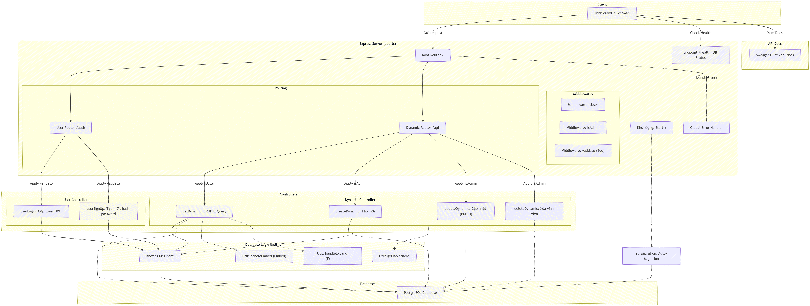

# Tác Giả: Hà Gia Minh
# Backend MiniProject API

Dự án Backend cung cấp các API phục vụ cho hệ thống, được xây dựng bằng Node.js (TypeScript) và cơ sở dữ liệu PostgreSQL. Dự án được tích hợp sẵn cấu hình Docker để dễ dàng triển khai và Swagger để cung cấp tài liệu API trực quan.

## Công nghệ sử dụng

- Runtime: Node.js (v22)
- Framework: Express.js
- Ngôn ngữ: TypeScript
- Cơ sở dữ liệu: PostgreSQL (v15)
- Query Builder: Knex.js (pg)
- Tài liệu API: Swagger UI
- Triển khai: Docker và Docker Compose

## Yêu cầu môi trường

Để khởi chạy dự án này trên máy tính, vui lòng đảm bảo bạn đã cài đặt:
1. Node.js (Phiên bản >= 18, khuyến nghị sử dụng v22)
2. Docker Desktop

## Cài đặt biến môi trường

Tạo một file .env ở thư mục gốc của dự án (ngang hàng với file package.json) và điền các thông tin sau:

DB_CLIENT=pg
DB_HOST=127.0.0.1
DB_PORT=5432
DB_USER=postgres
DB_PASSWORD=123456
DB_NAME=postgres
SECRET_KEY=JaeMin2k3

Lưu ý quan trọng: 
Đổi DB_HOST=db nếu bạn muốn đóng gói và chạy toàn bộ hệ thống bằng Docker (theo hướng dẫn ở Cách 2 bên dưới).

## Hướng dẫn khởi chạy dự án

Bạn có thể khởi chạy dự án theo 2 cách phụ thuộc vào mục đích sử dụng.

### Cách 1: Chạy môi trường Development (Khuyên dùng khi viết code)

Cách này giúp bạn sửa code đến đâu, server sẽ tự động cập nhật đến đó (thông qua nodemon) mà không cần phải build lại Docker.

1. Khởi động riêng cơ sở dữ liệu bằng Docker:
docker compose up -d db

2. Cài đặt các thư viện cần thiết:
npm install

3. Khởi chạy server Node.js:
npm start

### Cách 2: Chạy Full Docker (Đóng gói hoàn chỉnh)

Cách này sẽ đóng gói toàn bộ code Node.js và Database vào bên trong môi trường mạng nội bộ của Docker. Thích hợp để triển khai lên máy chủ.

1. Build image và khởi chạy toàn bộ hệ thống:
docker compose up -d --build

2. Kiểm tra log để đảm bảo server đã chạy không có lỗi:
docker compose logs -f app

3. Lệnh dừng toàn bộ hệ thống:
docker compose down

## Tài liệu API (Swagger)

Sau khi server khởi chạy thành công, bạn có thể xem tài liệu chi tiết và kiểm thử (test) trực tiếp các API thông qua giao diện UI của Swagger tại đường dẫn:
1. http://localhost:3000/api-docs
2. https://express-typescriptq.onrender.com/api-docs

## Danh sách các API chính

1. Nhóm API xác thực (Không yêu cầu Token)
- POST /auth/SignUp: Đăng ký tài khoản mới (Quyền mặc định là customer).
- POST /auth/login: Đăng nhập và nhận mã xác thực (JWT Token).

2. Nhóm API nghiệp vụ (Yêu cầu Bearer Token)
- GET /api/products: Lấy danh sách sản phẩm (Hỗ trợ tìm kiếm theo query 'q').
- POST /api/products: Thêm sản phẩm mới (Yêu cầu quyền Admin).
- PATCH /api/products/{id}: Cập nhật một phần thông tin sản phẩm (giá, số lượng).
- DELETE /api/products/{id}: Xóa vĩnh viễn sản phẩm.
- GET /api/orders: Lấy danh sách đơn hàng (Hỗ trợ query '_expand=users').
- GET /api/users: Lấy danh sách người dùng (Hỗ trợ query '_embed=orders').

## Hướng dẫn kiểm thử (Test) API bằng Swagger

1. Truy cập vào http://localhost:3000/api-docs hoặc https://express-typescriptq.onrender.com/api-docs
2. Tìm mở API POST /auth/login, nhập email và password để đăng nhập.
3. Copy đoạn Token mà server trả về (không copy dấu ngoặc kép).
4. Cuộn lên đầu trang, bấm vào nút Authorize.
5. Dán đoạn Token vừa copy vào ô trống và bấm xác nhận.
6. Bây giờ bạn đã có quyền để mở và kiểm thử tất cả các API còn lại của hệ thống.

## Mermaid Architecture Diagram

